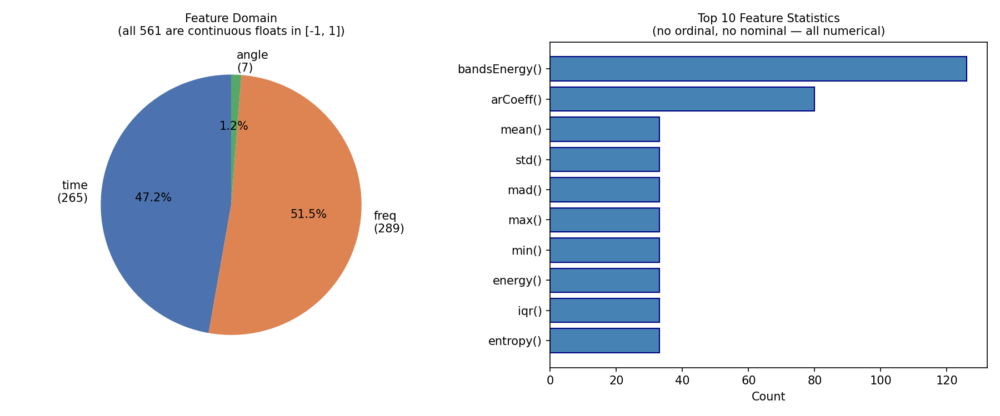
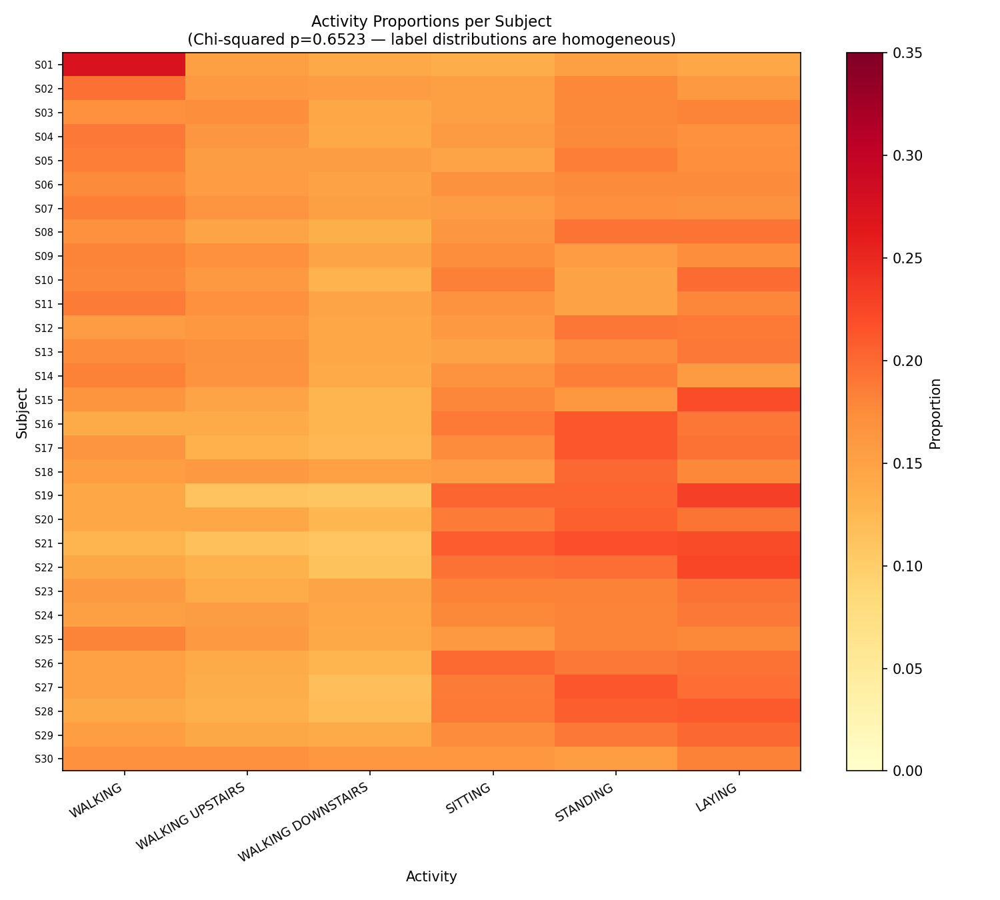
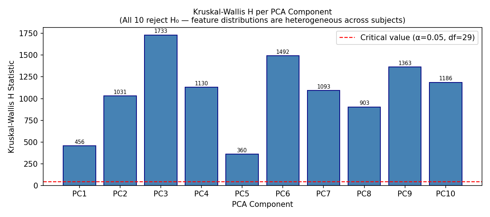
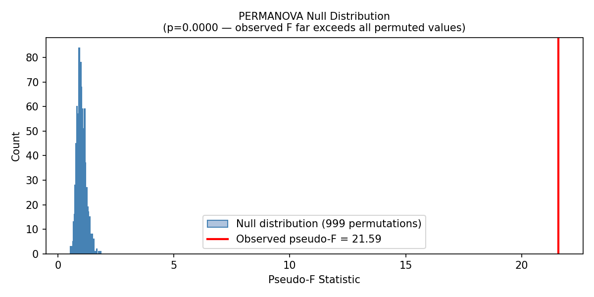
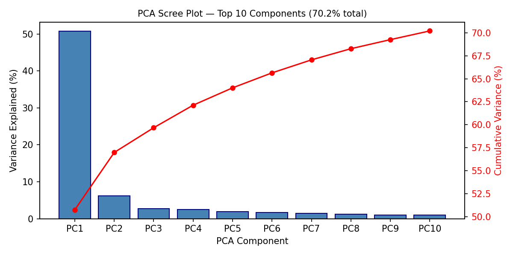
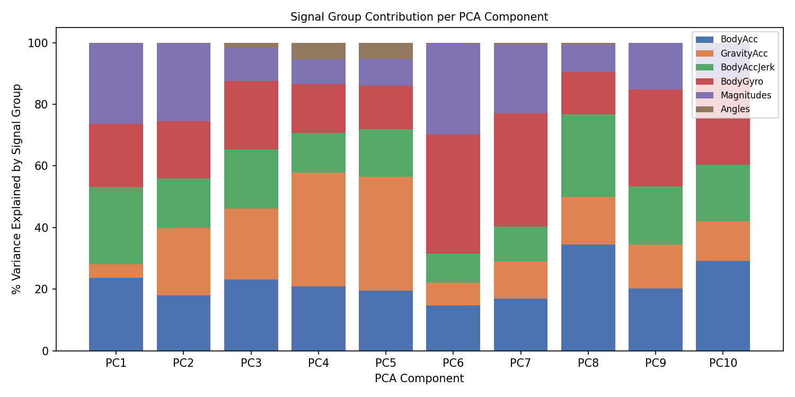
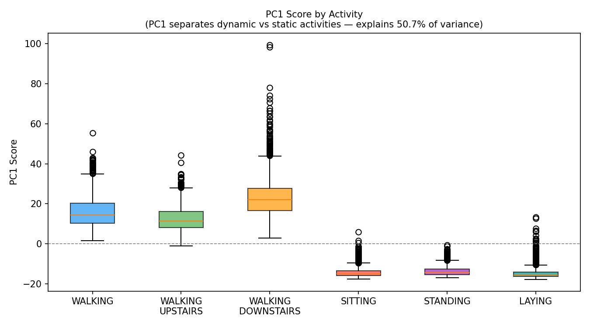
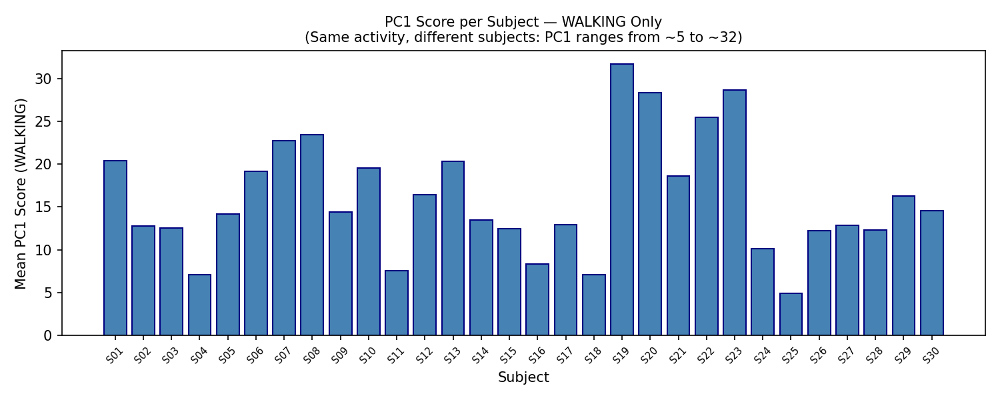

# UCI HAR Dataset — Homogeneity Analysis

**Dataset:** UCI Human Activity Recognition Using Smartphones  
**Subjects (FL clients):** 30 | **Activities:** 6 | **Samples:** 10,299 | **Features:** 561  
**Script:** `experiments/uci_homogeneity_test.py`

---

## 1. Are the Feature Types Numerical, Ordinal, or Nominal?

All 561 features are **continuous numerical floats, normalized to the range [−1, 1]**. There are no ordinal or nominal features.

Every feature is a statistical summary derived from two phone sensors — an **accelerometer** (linear acceleration in X/Y/Z) and a **gyroscope** (rotational velocity in X/Y/Z) — computed over 2.56-second sliding windows.

| Domain | Count | Description |
|---|---|---|
| Frequency domain (`f` prefix) | 289 | FFT-derived features (energy, frequency bands, skewness) |
| Time domain (`t` prefix) | 265 | Time-series statistics (mean, std, autoregressive coefficients) |
| Angle features | 7 | Angles between gravity mean vectors |

**Top 5 statistical types across all 561 features:**

| Statistic | Count | What it captures |
|---|---|---|
| `bandsEnergy()` | 126 | Energy in frequency sub-bands |
| `arCoeff()` | 80 | Autoregressive model coefficients (signal rhythm) |
| `mean()` | 33 | Average signal value per window |
| `std()` | 33 | Signal variability |
| `mad()` | 33 | Median absolute deviation (robust spread) |

No feature takes integer-only values. All are real-valued and safe for PCA, Kruskal-Wallis, and any continuous statistical test.

---

## 2. Homogeneity Tests

### 2.1 Test 1 — Chi-Squared Test of Homogeneity (Label Distributions)

**Question:** Are the activity proportions the same across all 30 subjects?

**Setup:** Built a 30 × 6 contingency table — rows are subjects, columns are the 6 activities, cells are sample counts. The chi-squared test of homogeneity tests whether the row proportions are identical.

| Result | Value |
|---|---|
| χ² statistic | 137.79 |
| Degrees of freedom | 145 |
| p-value | **0.6523** |
| Decision (α = 0.05) | **Fail to reject H₀ — label distributions are homogeneous** |

**Interpretation:** No subject specialises in one activity. Every subject performed all 6 activities for roughly equal durations, by experimental design. The p-value of 0.65 is well above the 0.05 threshold — the observed differences in counts are consistent with random variation.

The heatmap confirms uniform colouring across rows — no subject is systematically heavier in any activity column.

---

### 2.2 Test 2 — Kruskal-Wallis H-Test (Feature Distributions)

**Question:** Do the 30 subjects have the same feature distributions?

**Setup:** Applied PCA (top 10 components, explaining 70.2% of variance) to reduce 561 features. Applied Kruskal-Wallis to each PC across the 30 subject groups. Kruskal-Wallis is non-parametric — it tests whether K groups are drawn from the same distribution without assuming normality.

| PC | Variance Explained | H Statistic | p-value | Decision |
|---|---|---|---|---|
| PC1 | 50.7% | 456.23 | < 0.0001 | REJECT H₀ |
| PC2 | 6.2% | 1031.13 | < 0.0001 | REJECT H₀ |
| PC3 | 2.7% | 1732.68 | < 0.0001 | REJECT H₀ |
| PC4 | 2.5% | 1129.87 | < 0.0001 | REJECT H₀ |
| PC5 | 1.9% | 359.76 | < 0.0001 | REJECT H₀ |
| PC6 | 1.6% | 1492.28 | < 0.0001 | REJECT H₀ |
| PC7 | 1.4% | 1093.38 | < 0.0001 | REJECT H₀ |
| PC8 | 1.2% | 903.31 | < 0.0001 | REJECT H₀ |
| PC9 | 1.0% | 1362.83 | < 0.0001 | REJECT H₀ |
| PC10 | 0.9% | 1186.24 | < 0.0001 | REJECT H₀ |

**Result: 0/10 components are homogeneous across subjects.**

The critical value at α = 0.05, df = 29 is 42.56. Every observed H statistic is at minimum 8× this threshold. The feature distributions differ strongly across subjects.

---

### 2.3 Test 3 — PERMANOVA (Multivariate Distribution)

**Question:** Are the group centroids distinguishable in the full feature space?

**Setup:** Computed a pseudo-F statistic (between-group variance / within-group variance) on the top-10 PCA space. Built a null distribution by permuting subject labels 999 times. p-value = fraction of permuted F-statistics ≥ observed F.

| Result | Value |
|---|---|
| Observed pseudo-F | **21.5928** |
| Permutations | 999 |
| p-value | **< 0.001** (0/999 permuted values ≥ observed) |
| Decision | **Reject H₀ — group centroids differ across subjects** |

The observed pseudo-F of 21.59 sits entirely outside the null distribution. Between-group variance is 21× within-group variance — subjects are far more different from each other than samples within the same subject.

---

## 3. Nature of the PCA Components

### 3.1 Variance Explained

PC1 alone explains **50.7%** of total variance. The top 10 components together explain **70.2%**, meaning 561 features compress substantially into a low-dimensional space.

### 3.2 What Each PC Represents

Each PC is a weighted combination of the 561 original features. The table below shows which sensor signal group dominates each component, based on summed squared loadings.

| PC | Var% | Dominant Signal Group | Dominance | Physical meaning |
|---|---|---|---|---|
| PC1 | 50.7% | Magnitudes | 26.2% | Overall movement energy (how intensely the person moves) |
| PC2 | 6.2% | Magnitudes | 25.2% | Secondary energy axis (magnitude variation patterns) |
| PC3 | 2.7% | BodyAcc | 23.2% | Linear gait — stride length and pace |
| PC4 | 2.5% | GravityAcc | 36.9% | Phone orientation — how the device is held/worn |
| PC5 | 1.9% | GravityAcc | 36.8% | Secondary phone orientation axis |
| PC6 | 1.6% | BodyGyro | 38.6% | Rotational movement — hip/wrist swing |
| PC7 | 1.4% | BodyGyro | 36.8% | Secondary rotational axis |
| PC8 | 1.2% | BodyAcc | 34.5% | Detailed gait pattern (autoregressive coefficients) |
| PC9 | 1.0% | BodyGyro | 31.4% | Gyroscope frequency characteristics |
| PC10 | 0.9% | BodyAcc | 29.1% | Residual gait structure |

### 3.3 Why Every PC Is Heterogeneous

Heterogeneity is not concentrated in one source — it is spread across independent physical traits:

**PC1 (movement intensity):** While PC1 correctly separates dynamic activities (WALKING: mean = +15.8) from static ones (SITTING: mean = −14.2), the *amount* of intensity each person generates while walking varies 6× across subjects (S04: +7.1, S19: +31.7 — same activity, different person). Body size, fitness, stride length, and walking speed are all person-specific.

**PC4/PC5 (gravity acceleration — 37% dominance):** These components capture phone orientation relative to gravity. Different subjects wore or held the phone at different angles, making them distinguishable in these components *before any movement begins*.

**PC6/PC7/PC9 (gyroscope — 31–39% dominance):** Rotational gait signature. Hip sway, arm swing, and wrist rotation are highly personal biomechanical traits.

---

## 4. Summary

| Test | Result | Conclusion |
|---|---|---|
| Chi-squared (label distributions) | χ²=137.79, p=0.6523 | **Homogeneous** — balanced by experimental design |
| Kruskal-Wallis (feature distributions) | 0/10 PCs pass | **Heterogeneous** — all components reject H₀ |
| PERMANOVA (multivariate) | pseudo-F=21.59, p<0.001 | **Heterogeneous** — subjects separable in feature space |
| Feature types | All 561 continuous floats | **Numerical only** — no ordinal, no nominal |

**UCI HAR is label-homogeneous by experimental design, but feature-heterogeneous.** The study protocol ensured every subject performed every activity for equal time — producing balanced label distributions. However, each person's sensor signal encodes a unique biomechanical fingerprint across movement intensity, phone orientation, and rotational gait style. These person-specific traits are captured independently across multiple PCA components, which is why no component passes the Kruskal-Wallis test.

This finding supports using MIMIC-IV as the primary dataset: UCI HAR's apparent IID-ness is an artifact of controlled recording conditions, not genuine distributional homogeneity across clients.
